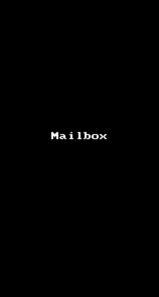

# Mailbox

This is a Mailbox High Fidelity Prototype application for iOS submitted as the [project 3](https://courses.codepath.com/courses/ios_for_designers/unit/3#!assignment) for CodePath: iOS for Designers.

Time spent: 3.5 hr

Completed:

* [x] Required: Drag messsage right
* [x] Required: Drag message left
* [x] Required: Dismiss the reschedule list option
* [x] Required: Tutorial Screens
* [x] Optional: Panning from the edge reveals menu

